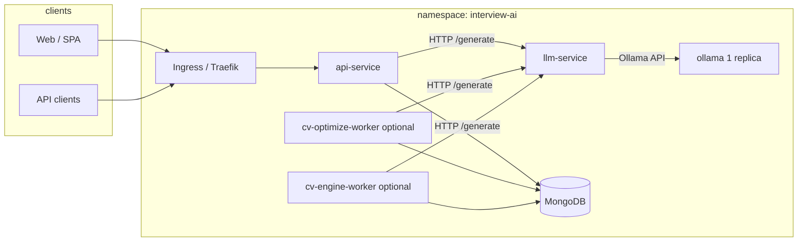

# Full stack: LLM path, resources, and “good results” on one node

## Production baseline: **Oracle VM.Standard.A1.Flex** (8 OCPU, 48 GiB RAM)

The repo’s **`k8s/ollama/deployment.yaml`** is tuned for this **ARM** shape (block storage, single-node k3s/OKE-style cluster):

| Setting | Value (summary) |
|--------|------------------|
| **Ollama requests** | 12 GiB RAM, 3.5 CPU |
| **Ollama limits** | 28 GiB RAM, 7.5 CPU |
| **`OLLAMA_NUM_PARALLEL`** | `2` (parallel CV `/generate` where RAM allows) |

**Local dev on a weak laptop:** lower Ollama requests/limits and set **`OLLAMA_NUM_PARALLEL=1`** so the pod schedules.

**Autoscaling (HPA):** **`llm-service`** can scale up to **4** replicas when CPU/memory utilization is high (more HTTP capacity to Ollama). **`api-service` HPA `maxReplicas: 1`** on the default install because **CV uploads use a ReadWriteOnce PVC** — a second api pod cannot mount the same volume on one node. For horizontal **api** scaling you need **RWX** or **object storage** for `UPLOAD_DIR`; then raise `maxReplicas` in `k8s/hpa/stateless-services.yaml`. **Ollama** stays **1 replica** unless you add nodes + storage strategy (see below).

**Faster under load when you stay on one VM:** the VM already uses **maximum OCPU count** for that shape (8). Kubernetes **limits** let Ollama burst up to **7.5** cores; the rest goes to the system and other pods. To go faster you **resize the Flex shape** (more OCPUs/RAM) or add **worker nodes** and split services.

This doc explains how Interview Genie uses your cluster end-to-end and where **CPU and RAM** go.

## Traffic and components



- **api-service** — auth, CV upload, job APIs, orchestration; talks to **MongoDB** and **llm-service**.
- **llm-service** — thin FastAPI proxy: JSON `/generate` → Ollama `/api/generate` (`format: json`, `num_predict` from env).
- **ollama** — **only place model weights run**; this is the **throughput and latency bottleneck** for quality/speed.
- **Workers** (if enabled) — same LLM path as the API; more concurrency **queues at Ollama** unless you tune parallelism (below).

## Where “maximum resource” should go

| Goal | What to scale |
|------|----------------|
| Faster / smarter **inference** | **Ollama pod**: CPU limit, RAM limit, bigger VM, GPU if available. |
| More **HTTP fan-out** / readiness | **llm-service** replicas (HPA); helps many connections, **not** total tokens/sec if Ollama is saturated. |
| Faster **CV pipelines** (parallel sections) | **Ollama `OLLAMA_NUM_PARALLEL`** (see `k8s/ollama/deployment.yaml`) + enough RAM; **api** `CV_OPTIMIZE_PARALLEL_SECTIONS` / CV engine workers. |
| Bigger **JSON outputs** | **llm-service** `OLLAMA_NUM_PREDICT` and **api** `LLM_OPTIMIZE_TIMEOUT_SECONDS` (longer wall clock, not more cores). |

**Single-node reality:** You have **one Ollama Deployment** and a **ReadWriteOnce** model PVC, so **one Ollama pod** is expected. “Scale out” Ollama needs **multiple nodes + multiple PVCs or RWX storage** and **multi-host routing in llm-service** (not in this repo by default).

## Same shape, already matches manifests

If your node is **VM.Standard.A1.Flex · 8 OCPU · 48 GiB**, the checked-in **`k8s/ollama/deployment.yaml`** and **`k8s/llm-service/deployment.yaml`** already match the table above. Verify with:

`kubectl describe node` → **Allocatable** memory/cpu; if **Ollama is Pending**, lower **requests** slightly.

## Ollama parallelism (see Deployment env)

- **`OLLAMA_NUM_PARALLEL`**: **`2`** in repo for production A1.Flex; use **`1`** on small dev machines if you see OOM.
- **`OLLAMA_MAX_LOADED_MODELS=1`** — keeps a **single** model resident; best for **one production model** (e.g. `mistral`) on CPU RAM.

## Operational checklist for “good results”

1. **Model pulled and warm:** `kubectl exec -n interview-ai deploy/ollama -- ollama list` includes `mistral`. Hit **llm-service** `/warmup` or rely on startup warmup.
2. **No Pending pods:** `kubectl describe pod -n interview-ai -l app=ollama` — if `Insufficient cpu/memory`, lower **requests** or enlarge the VM.
3. **Timeouts:** Long CV jobs need **api-service** / **worker** LLM timeouts and **llm-service** `OLLAMA_TIMEOUT_SECONDS` aligned (see `docker-compose.yml` / Deployment env).
4. **Quality vs speed:** Smaller quantizations / different models are an **Ollama model choice**, not Kubernetes replicas.

## Larger VM (~24 vCPU / ~96–100 GiB RAM) — does it help?

**Yes.** For this architecture the upgrade mainly improves **Ollama** and **headroom** for everything else on the same k3s node.

| Area | Why it helps |
|------|----------------|
| **Ollama** | More **RAM** → larger context, higher **`OLLAMA_NUM_PARALLEL`**, less risk of OOM under parallel CV jobs. More **CPU** → faster token generation for Mistral-class models on CPU. |
| **Mongo / api-service / workers** | Extra RAM/CPU reduces **competition** with Ollama; you can raise **api-service** or worker replicas/HPA caps if you tune manifests. |
| **llm-service HPA** | You can safely raise **`maxReplicas`** (e.g. 5–8) so many concurrent HTTP clients do not queue on a tiny proxy — inference is still capped by **one Ollama pod**. |
| **Does not change by itself** | Still **one Ollama** (RWO PVC). You do **not** get linear “24×” speedup unless you **raise Ollama’s requests/limits** and **parallelism** to use the new capacity. |

**Allocatable vs marketing:** A “100 GB” instance usually exposes **~90–96 GiB** to pods after kube/system reserve. Leave **~12–20 GiB** for Mongo, api-service, ingress, metrics, OS — then give Ollama a **large slice** of the rest.

### Suggested manifest tweaks after you resize the VM

Edit `k8s/ollama/deployment.yaml` (adjust if `kubectl describe node` shows less allocatable).

**Container `resources`** (example for ~24 vCPU / ~96–100 GiB — leave room for Mongo + api + system):

```yaml
resources:
  requests:
    memory: "32Gi"
    cpu: "8000m"
  limits:
    memory: "64Gi"
    cpu: "20000m"
```

**Same container `env`** — raise parallel generations only when RAM allows (try `3` before `4` if you see OOM):

```yaml
- name: OLLAMA_NUM_PARALLEL
  value: "4"
- name: OLLAMA_MAX_LOADED_MODELS
  value: "1"
```

Then optionally in `k8s/hpa/stateless-services.yaml` for **llm-service**, set **`maxReplicas: 5`** (or higher) so the proxy layer matches a busier node.

After apply: `kubectl top pods -n interview-ai` during a heavy CV job — **ollama** should use a much larger share of CPU/RAM than on the 8 vCPU box.

## Related docs

- `docs/K8S-SCALING-AND-ROLLING.md` — RWO PVCs, HPA, why api/ollama are special.
- `README.md` — local compose, `OLLAMA_HOST`, pulling models.
