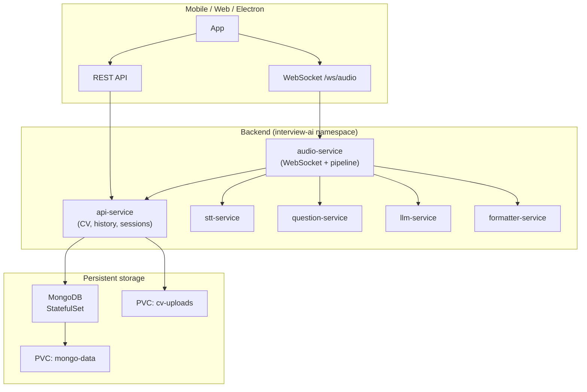

# Interview Genie – Kubernetes Standalone Blueprint (No Login)

Real-time interview assistant: live voice transcription, LLM answers, CV analysis, MongoDB history. **No Auth0/login**; all data stored in Kubernetes with persistent volumes.

---

## 1. Architecture Overview



**Conceptual view (single-backend perspective)**

```
                   ┌───────────────────────────────┐
                   │       Mobile App UI           │
                   │  (React Native / Flutter)     │
                   │-------------------------------│
                   │ - Upload CV                   │
                   │ - Live Question Display       │
                   │ - Live Answer Streaming       │
                   │ - History Display             │
                   └───────────────┬───────────────┘
                                   │
            ┌──────────────────────┴───────────────────────┐
            │      Backend (Kubernetes Pods)                │
            │  audio-service, api-service, stt, llm, etc.   │
            │-----------------------------------------------│
            │ - Audio streaming (WebSocket)                 │
            │ - Live transcription (Whisper)                │
            │ - Question completion detection               │
            │ - LLM answer generation (Ollama)              │
            │ - CV parsing & REST API                       │
            │ - CV storage mount (Persistent Volume)        │
            └───────────────┬───────────────────────────────┘
                            │
            ┌───────────────┴───────────────┐
            │  CV File Storage (PVC)        │
            │  cv-uploads → /cv_storage     │
            │  Safe from backend updates    │
            └───────────────┬───────────────┘
                            │
            ┌───────────────┴───────────────┐
            │   MongoDB StatefulSet         │
            │   CVs, Q&A History, Sessions  │
            │   PVC → data persists         │
            └───────────────────────────────┘
```

**High level**

- **Clients** use WebSocket for live audio + answer streaming and REST for CV upload and Q&A history.
- **audio-service** runs the pipeline (STT → question + optional CV context → LLM → formatter) and calls api-service to fetch CV context and save Q&A.
- **api-service** handles CV upload/parsing, stores files on a PVC and metadata + parsed text in MongoDB; history and sessions in MongoDB.
- **MongoDB** runs as a StatefulSet with its own PVC so data survives pod updates and restarts.

---

## 2. Persistent Storage Layout

| Resource        | Purpose                    | Access mode   | Typical size |
|----------------|----------------------------|---------------|--------------|
| **mongo-data** | MongoDB data directory     | ReadWriteOnce | 10Gi+        |
| **cv-uploads** | Uploaded CV files (PDF/DOCX/TXT) | ReadWriteOnce | 5Gi+   |

- **MongoDB StatefulSet**: one replica; volumeClaimTemplates or single PVC bound to `mongo-data`. Data persists across pod replacement and upgrades.
- **api-service**: mounts `cv-uploads` at `UPLOAD_DIR` (e.g. `/cv_storage`). CV files survive redeploys and scaling.

---

## 3. No-Login Model

- No Auth0 or user login.
- **Option A (minimal change):** Client sends a fixed header, e.g. `X-User-Id: default`. API and audio-service behave as today; all data is associated with that single “user”.
- **Option B (schema change):** API runs in a `NO_LOGIN` mode: omit `user_id` from CVs, Q&A history, and sessions; use a single logical tenant. Requires small API and audio-service changes (e.g. optional user_id, default session_id).

This blueprint assumes **Option A** so existing API and audio-service logic stays the same; use a constant `X-User-Id` (e.g. `default`) from the client and optionally a generated `session_id` per “mock interview”.

---

## 4. MongoDB Schema (Standalone)

Same as current API; documents can use a constant `user_id` (e.g. `"default"`) when using Option A.

### CVs

```json
{
  "_id": ObjectId(),
  "user_id": "default",
  "filename": "cv.pdf",
  "parsed_text": "...",
  "uploaded_at": ISODate(),
  "original_file_path": "/cv_storage/cv_123.pdf"
}
```

### Q&A History

```json
{
  "_id": ObjectId(),
  "user_id": "default",
  "cv_id": ObjectId(),
  "question": "What is my AWS experience?",
  "answer": "Worked with EC2, S3, Lambda...",
  "timestamp": ISODate(),
  "session_id": "session_001"
}
```

### Sessions (optional)

```json
{
  "_id": ObjectId(),
  "user_id": "default",
  "session_name": "Mock Interview",
  "start_time": ISODate(),
  "end_time": ISODate()
}
```

---

## 5. Kubernetes Resource Map

```
k8s/
├── namespace.yaml
├── kustomization.yaml
├── mongo/
│   ├── statefulset.yaml      # MongoDB 8; volumeClaimTemplate mongo-data (10Gi) → /data/db
│   └── service.yaml          # Headless, port 27017
├── api-service/
│   ├── pvc.yaml              # cv-uploads (5Gi)
│   ├── deployment.yaml       # env: MONGODB_URI, UPLOAD_DIR; mount cv-uploads at /cv_storage
│   └── service.yaml          # ClusterIP, port 8001
├── audio-service/
│   ├── deployment.yaml       # API_SERVICE_URL=http://api-service:8001
│   └── service.yaml
├── stt-service/ ...
├── question-service/ ...
├── llm-service/ ...
├── formatter-service/ ...
├── ollama/
│   ├── pvc.yaml
│   ├── deployment.yaml
│   └── service.yaml
└── ingress/
    └── ...
```

---

## 6. Key Configuration

### MongoDB

- **MONGODB_URI**: `mongodb://mongo:27017` (or `mongodb://mongo-service:27017` depending on Service name).
- **MONGODB_DB**: e.g. `interview_ai`.

### API service

- **MONGODB_URI**, **MONGODB_DB**: from above.
- **UPLOAD_DIR**: `/cv_storage` (mount path of cv-uploads PVC).
- **AUTH0_DOMAIN** / **AUTH0_AUDIENCE**: leave unset for no-login; use **X-User-Id: default** (or any fixed value) from clients.

### Audio service

- **API_SERVICE_URL**: `http://api-service:8001` so it can fetch CV context and POST history.

### Client (no login)

- REST: send **X-User-Id: default** (or a constant device/session id).
- WebSocket: first JSON message can include `user_id: "default"`, optional `session_id`, optional `cv_id` so answers use CV context and Q&A are saved.

---

## 7. Step-by-step deployment plan

All manifests live under `k8s/`; use **kustomize** to apply in one go, or apply in order for clarity.

### Option A: Apply everything with Kustomize (recommended)

```bash
# From repo root
kubectl apply -k k8s/

# Wait for MongoDB to be ready (StatefulSet creates mongo-0)
kubectl wait --for=condition=ready pod -l app=mongo -n interview-ai --timeout=120s

# Pull LLM model (after Ollama pod is up)
kubectl exec -n interview-ai deploy/ollama -- ollama pull mistral
```

### Option B: Apply in order (for debugging or staged rollout)

| Step | Command | What it does |
|------|---------|--------------|
| 1 | `kubectl apply -f k8s/namespace.yaml` | Create `interview-ai` namespace |
| 2 | `kubectl apply -f k8s/mongo/service.yaml` | MongoDB headless Service |
| 3 | `kubectl apply -f k8s/mongo/statefulset.yaml` | MongoDB pod + PVC (volumeClaimTemplate) |
| 4 | `kubectl wait --for=condition=ready pod -l app=mongo -n interview-ai --timeout=120s` | Wait for MongoDB |
| 5 | `kubectl apply -f k8s/api-service/pvc.yaml` | cv-uploads PVC |
| 6 | `kubectl apply -f k8s/api-service/deployment.yaml` | api-service (mounts cv-uploads) |
| 7 | `kubectl apply -f k8s/api-service/service.yaml` | api-service ClusterIP |
| 8 | `kubectl apply -f k8s/ollama/pvc.yaml` | Ollama models PVC (if not already) |
| 9 | `kubectl apply -f k8s/ollama/deployment.yaml` | Ollama deployment |
| 10 | `kubectl apply -f k8s/ollama/service.yaml` | Ollama service |
| 11 | `kubectl apply -f k8s/audio-service/deployment.yaml` `kubectl apply -f k8s/audio-service/service.yaml` | Audio service |
| 12 | `kubectl apply -f k8s/stt-service/...` (and question, llm, formatter) | Pipeline services |
| 13 | `kubectl apply -f k8s/ingress/ingressroute.yaml` (or ingress-v1.yaml) | Expose API/WebSocket |

### Verify

```bash
kubectl get pods -n interview-ai
kubectl get pvc -n interview-ai
# Port-forward to test locally:
kubectl port-forward -n interview-ai svc/audio-service 8000:8000
kubectl port-forward -n interview-ai svc/api-service 8001:8001
# Then: curl http://localhost:8000/health && curl http://localhost:8001/health
```

---

## 8. Architecture highlights

| Layer | Role |
|-------|------|
| **Mobile / Electron** | Streams audio via WebSocket; uploads CV and fetches history via REST. |
| **Backend pods** | audio-service (pipeline + WebSocket), api-service (CV parse, history), stt, question, llm, formatter, ollama. |
| **MongoDB StatefulSet** | CV metadata, parsed text, Q&A history, sessions; PVC for persistence. |
| **CV storage** | Separate PVC (`cv-uploads`) mounted on api-service; original files survive redeploys. |

**Advantages:** Live transcription and answers; data persists across pod updates; no login; scalable; deployable on Oracle Cloud, AWS, or local (e.g. k3s).

---

## 9. Data Persistence Guarantees

- **MongoDB**: All CV metadata, parsed text, Q&A history, and sessions live in MongoDB’s data directory on **mongo-data** PVC. Survives StatefulSet pod delete/recreate and upgrades.
- **CV files**: Stored under **cv-uploads** at `UPLOAD_DIR`. Survives api-service pod restarts and redeploys.
- **Ollama models**: Existing ollama PVC; separate from MongoDB and CV storage.

---

## 10. User Flow (Standalone)

1. **Upload CV** → POST to api-service with `X-User-Id: default` → parse and store in MongoDB + file on PVC.
2. **Ask questions** → WebSocket to audio-service; send `user_id`, optional `session_id`, optional `cv_id`; speak or type → live transcription and streamed LLM answer; Q&A saved via api-service.
3. **History** → GET history/sessions/CVs from api-service with `X-User-Id: default`.

This gives a **ready-to-implement Kubernetes blueprint** with persistent storage for the standalone, no-login Interview Genie deployment.
