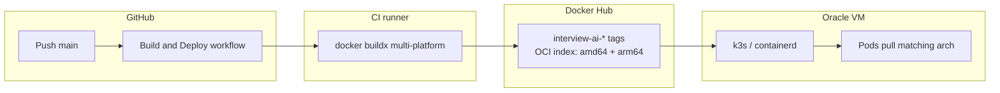

# Oracle Cloud: architecture and image compatibility

This document ties together **CPU architecture**, **CI-built images**, and **how you run** the stack on Oracle (Docker Compose vs k3s). Use it when debugging **502**, **ImagePullBackOff**, or **exec format error**.

## 1. What Oracle gives you (two common paths)

| Oracle VM shape | Node OS / arch (Linux) | What must exist on Docker Hub for your app images |
|-----------------|-------------------------|-----------------------------------------------------|
| **Ampere A1** (common free tier) | **aarch64** → Kubernetes reports **arm64** | **`linux/arm64`** in the image index (or multi-arch with arm64) |
| **AMD (x86_64)** | **amd64** | **`linux/amd64`** (multi-arch is fine; node picks amd64) |

**Guest OS** (Ubuntu vs Oracle Linux) does not replace the table above: the **CPU** of the shape decides which manifest containerd pulls.

## 2. Git → CI → registry → cluster (k3s)



- **`.github/workflows/build-and-deploy.yml`** resolves **`DOCKER_BUILD_PLATFORMS`** (repo variable) or defaults to **`linux/amd64,linux/arm64`** so **one tag** can serve **both** Oracle shape families.
- **`scripts/ci/k8s-apply.sh`** sets deployments to **`${DOCKERHUB_USERNAME}/interview-ai-<service>:<tag>`**.
- If **`vars.DOCKER_BUILD_PLATFORMS`** is set to **`linux/amd64` only**, **Ampere** nodes will fail with **`no match for platform in manifest`**.

**Verify after a successful build:**

```bash
docker manifest inspect YOURUSER/interview-ai-web:latest
```

You should see **`architecture": "arm64"`** and **`"amd64"`** when using the default multi-arch workflow.

## 3. Kubernetes stack in this repo (what runs on the VM)

- **Ingress:** Traefik (k3s) → `web`, `api-service`, `audio-service`, etc.
- **Stateful:** Mongo (`mongo:8.0` in manifests — FCV upgrade path from older 7.x data), Ollama (PVC).
- **App images:** eight workloads receive Hub images from CI (`api-service`, `audio-service`, `stt-service`, `question-service`, `llm-service`, `formatter-service`, `monitoring-service`, `web`).
- **Whisper:** not deployed as its own Kubernetes Deployment in `k8s/`; local **Docker Compose** can run `whisper-service` with **`platform: linux/amd64`** (see below).

## 4. Docker Compose on Oracle (Option A in `DEPLOY-ORACLE-CLOUD.md`)

- **`whisper-service`** uses **`platform: linux/amd64`**. On an **Ampere ARM** VM, Docker runs that image via **QEMU emulation** (works but can be **slow**). On an **AMD64** VM, it runs natively.
- **Mongo** in `docker-compose.yml` should stay aligned with **`k8s/mongo/statefulset.yaml`** (**`mongo:8.0`**) to avoid the same **FCV / major jump** issues as a bad **`mongo:8` → 8.2** jump on existing data.
- **Public images** (`mongo`, `ollama/ollama`): anonymous **Docker Hub** pulls can hit **rate limits**; **`docker login`** on the VM helps.

## 5. Checklist before blaming “Oracle”

1. **`uname -m`** on the VM: `aarch64` vs `x86_64`.
2. **Hub manifest** includes the matching **OS/arch** for that node.
3. **GitHub Actions variable** `DOCKER_BUILD_PLATFORMS` is **not** locking **amd64-only** if the node is **ARM**.
4. **Secrets:** `DOCKERHUB_TOKEN`, `DOCKERHUB_USERNAME`, and deploy (`KUBE_CONFIG` or SSH) are set.
5. **Mongo:** if upgrading from old data, use **`mongo:8.0`** (see `k8s/mongo/statefulset.yaml`) and plan Docker Hub auth for pulls.

## 6. Related docs

- **`docs/DEPLOY-ORACLE-CLOUD.md`** — create VM, Compose vs k3s.
- **`docs/DEPLOY-GIT-K8S.md`** — GitHub Actions deploy modes, ARM note.
- **`docs/DEPLOY-SPEED.md`** — `DOCKER_BUILD_PLATFORMS`, build speed tradeoffs.
