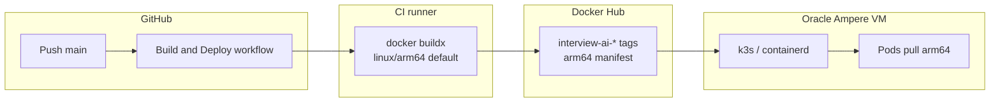

# Oracle Cloud: architecture and image compatibility

This document ties together **CPU architecture**, **CI-built images**, and **how you run** the stack on Oracle (Docker Compose vs k3s). Use it when debugging **502**, **ImagePullBackOff**, or **exec format error**.

## 0. Project default: **linux/arm64**

**Intended targets:** **Apple Silicon (M1/M2/M3) dev machines** and **Oracle Ampere (aarch64) production**. CI and helper scripts default to **`linux/arm64`** so one image tag matches both.

**If you use x86_64 servers only:** set GitHub variable **`DOCKER_BUILD_PLATFORMS=linux/amd64`** (faster on GitHub’s amd64 runners — no QEMU for the app image build).

**If you need one tag for both amd64 and arm64:** **`DOCKER_BUILD_PLATFORMS=linux/amd64,linux/arm64`**.

## 1. What Oracle gives you (two common paths)

| Oracle VM shape | Node OS / arch (Linux) | What must exist on Docker Hub for your app images |
|-----------------|-------------------------|-----------------------------------------------------|
| **Ampere A1** (common free tier) | **aarch64** → **arm64** | **`linux/arm64`** (repo default) |
| **AMD (x86_64)** | **amd64** | **`linux/amd64`** — set **`DOCKER_BUILD_PLATFORMS=linux/amd64`** (or multi-arch) |

**Guest OS** (Ubuntu vs Oracle Linux) does not replace the table above: the **CPU** of the shape decides which manifest containerd pulls.

## 2. Git → CI → registry → cluster (k3s)



- **`.github/workflows/build-and-deploy.yml`** uses **`DOCKER_BUILD_PLATFORMS`** or defaults to **`linux/arm64`**.
- **`scripts/ci/k8s-apply.sh`** sets deployments to **`${DOCKERHUB_USERNAME}/interview-ai-<service>:<tag>`**.
- **Ampere** + **amd64-only** Hub images → **`no match for platform in manifest`**.

**Verify after a successful build:**

```bash
docker manifest inspect YOURUSER/interview-ai-web:latest
```

With the default workflow you should see **`"architecture": "arm64"`** (single-arch index or multi-arch entry).

## 3. Kubernetes stack in this repo (what runs on the VM)

- **Ingress:** Traefik (k3s) → `web`, `api-service`, `audio-service`, etc.
- **Stateful:** Mongo (`mongo:8.0`), Ollama (PVC).
- **App images:** eight workloads from CI (`api-service`, `audio-service`, `stt-service`, `question-service`, `llm-service`, `formatter-service`, `monitoring-service`, `web`).
- **Whisper:** not a separate Deployment in `k8s/`; **Docker Compose** builds `whisper-service` **native arm64** by default (same as M1 / Ampere).

## 4. Docker Compose (local + Oracle Option A)

- **Whisper:** no forced **`platform: linux/amd64`** — builds **arm64** on M1 and on Ampere. On **amd64-only** hosts, add under `whisper-service`: **`platform: linux/amd64`**.
- **Mongo:** **`mongo:8.0`** in compose, aligned with **`k8s/mongo/statefulset.yaml`**.
- **Public images** (`mongo`, `ollama/ollama`): **`docker login`** on the VM avoids Docker Hub **rate limits**.

## 5. Checklist before blaming “Oracle”

1. **`uname -m`** on the VM: `aarch64` vs `x86_64`.
2. **Hub manifest** **`architecture`** matches the node (**arm64** vs **amd64**).
3. **`DOCKER_BUILD_PLATFORMS`** not wrong for your hardware (default **arm64**; use **amd64** only for x86_64-only fleets).
4. **Secrets:** `DOCKERHUB_TOKEN`, `DOCKERHUB_USERNAME`, deploy (`KUBE_CONFIG` or SSH).
5. **Mongo:** **`mongo:8.0`** for FCV safety; Hub auth for pulls.

## 6. Related docs

- **`docs/DEPLOY-ORACLE-CLOUD.md`** — create VM, Compose vs k3s.
- **`docs/DEPLOY-GIT-K8S.md`** — GitHub Actions deploy modes.
- **`docs/DEPLOY-SPEED.md`** — `DOCKER_BUILD_PLATFORMS`, QEMU, speed.
