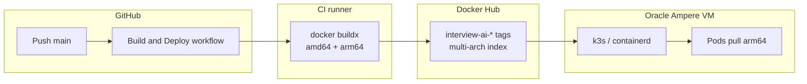

# Oracle Cloud: architecture and image compatibility

This document ties together **CPU architecture**, **CI-built images**, and **how you run** the stack on Oracle (Docker Compose vs k3s). Use it when debugging **502**, **ImagePullBackOff**, or **exec format error**.

## 0. CI default: **multi-arch (`linux/amd64` + `linux/arm64`)**

**Build and Deploy** builds **both** architectures every time (fixed in the workflow) so **Oracle Ampere** and **amd64** VMs both pull a matching manifest **without** setting a GitHub variable.

**Deploy** (`scripts/ci/k8s-apply.sh`) also creates **`interview-ai-dockerhub`** pull credentials from **`DOCKERHUB_USERNAME` + `DOCKERHUB_TOKEN`** and attaches them to the **`default`** and **`monitoring-service`** service accounts so **mongo** and other Hub pulls use **authenticated** limits (reduces anonymous **429** errors).

## 1. What Oracle gives you (two common paths)

| Oracle VM shape | Node OS / arch (Linux) | What must exist on Docker Hub for your app images |
|-----------------|-------------------------|-----------------------------------------------------|
| **Ampere A1** (common free tier) | **aarch64** → **arm64** | **`linux/arm64`** (repo default) |
| **AMD (x86_64)** | **amd64** | **`linux/amd64`** — set **`DOCKER_BUILD_PLATFORMS=linux/amd64`** (or multi-arch) |

**Guest OS** (Ubuntu vs Oracle Linux) does not replace the table above: the **CPU** of the shape decides which manifest containerd pulls.

## 2. Git → CI → registry → cluster (k3s)



- **`.github/workflows/build-and-deploy.yml`** sets **`linux/amd64,linux/arm64`** in the **Configure Docker platforms** step (not driven by repo variables).
- **`scripts/ci/k8s-apply.sh`** sets deployments to **`${DOCKERHUB_USERNAME}/interview-ai-<service>:<tag>`**.
- **Ampere** + **amd64-only** Hub images → **`no match for platform in manifest`**.

**Verify after a successful build:**

```bash
docker manifest inspect YOURUSER/interview-ai-web:latest
```

You should see **both** **`arm64`** and **`amd64`** entries in the index for **`interview-ai-web:latest`** (plus no useless `unknown/unknown` attestations when **BUILDX_NO_DEFAULT_ATTESTATIONS** / **--provenance=false** apply).

## 3. Kubernetes stack in this repo (what runs on the VM)

- **Ingress:** Traefik (k3s) → `web`, `api-service`, `audio-service`, etc.
- **Stateful:** Mongo (`mongo:8.0`) with PVC via StorageClass **`interview-mongo`** (Retain) + StatefulSet PVC retention; Ollama (PVC). See **`docs/DEPLOY-ORACLE-CLOUD.md`** for migration and OCI Block Volume CSI.
- **App images:** eight workloads from CI (`api-service`, `audio-service`, `stt-service`, `question-service`, `llm-service`, `formatter-service`, `monitoring-service`, `web`).
- **Whisper:** not a separate Deployment in `k8s/`; **Docker Compose** builds `whisper-service` **native arm64** by default (same as M1 / Ampere).

## 4. Docker Compose (local + Oracle Option A)

- **Whisper:** no forced **`platform: linux/amd64`** — builds **arm64** on M1 and on Ampere. On **amd64-only** hosts, add under `whisper-service`: **`platform: linux/amd64`**.
- **Mongo:** **`mongo:8.0`** in compose, aligned with **`k8s/mongo/statefulset.yaml`**.
- **k3s:** deploy applies **pull secrets** from CI; for Compose-only on a VM you may still **`docker login`** locally.

## 5. Checklist before blaming “Oracle”

1. **`uname -m`** on the VM: `aarch64` vs `x86_64`.
2. **Hub manifest** includes **`arm64` or `amd64`** as needed (CI builds both).
3. **Secrets:** `DOCKERHUB_TOKEN`, `DOCKERHUB_USERNAME`, deploy (`KUBE_CONFIG` or SSH) — token is used for cluster pull secret + builds.
4. **Mongo:** **`mongo:8.0`** for FCV safety.

## 6. Related docs

- **`docs/DEPLOY-ORACLE-CLOUD.md`** — create VM, Compose vs k3s.
- **`docs/DEPLOY-GIT-K8S.md`** — GitHub Actions deploy modes.
- **`docs/DEPLOY-SPEED.md`** — QEMU, cache, timing.
